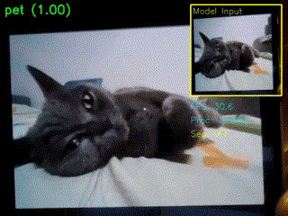

# 🔍 Real-Time Entity Classification System

A smart computer vision system that identifies and classifies people and pets in real-time using advanced deep learning techniques.



## ✨ Key Features

- **Four-Class Detection**: Accurately identifies `owner`, `pet`, `other person`, and `background` classes
- **Adaptive Processing**: Automatically switches between classification and segmentation for improved accuracy
- **Real-Time Performance**: ~33 FPS on consumer hardware (NVIDIA RTX 3050)
- **Privacy-Focused**: All processing happens locally on your device
- **Interactive Controls**: Toggle segmentation mode and visualize confidence scores
- **Memory Efficient**: Optimized for resource-constrained environments

## 🧠 Technical Overview

This project combines transfer learning with efficient model deployment to create a responsive computer vision system that runs smoothly on mid-range hardware:

- **Base Architecture**: MobileNetV2 (finetuned from ImageNet weights)
- **Enhancement**: LRASPP MobileNetV3 segmentation model for challenging cases
- **Confidence Threshold**: Auto-switching between models at 0.7 confidence level
- **Training Method**: Transfer learning with frozen feature extraction layers
- **Performance**: 99.4% accuracy in ideal conditions, 84.2% in low light

## 📊 Model Specifications

| Attribute | Value |
|-----------|-------|
| Architecture | MobileNetV2 (finetuned) |
| Input Resolution | 224x224 (resized from 640x480) |
| Output Classes | `['owner', 'pet', 'other person', 'background']` |
| Model Format | `.pth` |
| Model Size | ~10 MB (quantized) |
| Inference Speed | 33 FPS @ 640x480 |
| Hardware Tested | NVIDIA RTX 3050, CUDA 11.8 |
| Framework | PyTorch 3.13.2 |

## 🚀 Getting Started

### Prerequisites

```bash
# Clone the repository
git clone https://github.com/dosqas/Realtime-Entity-Classifier.git
cd Realtime-Entity-Classifier

# Create and activate virtual environment
python -m venv venv
source venv/bin/activate  # On Windows: venv\Scripts\activate

# Install dependencies
pip install -r requirements.txt
```

### Running the Classifier

```bash
python src/realtime_classifier.py
```

### Controls

- Press `s` to toggle forced segmentation mode
- Press `q` to quit

## 🏗️ Architecture Details

### Classification Model (MobileNetV2)

The system uses a modified MobileNetV2 architecture with:

```python
model.classifier[1] = nn.Sequential(
    nn.Linear(model.classifier[1].in_features, 256),
    nn.ReLU(),
    nn.Dropout(0.2),
    nn.Linear(256, 4)
)
```

- **Intermediate Layer (256 neurons)**: Enhanced representational capacity
- **ReLU Activation**: Efficient non-linearity
- **Dropout (0.2)**: Prevents overfitting
- **Xavier Initialization**: Improves convergence speed

### Training Configuration

- **Optimizer**: Adam with selective training
- **Learning Rate**: 5e-5
- **Weight Decay**: 1e-5
- **Loss Function**: CrossEntropyLoss with label smoothing (0.1)
- **Epochs**: 10 (converged early)

### Segmentation Enhancement

When classification confidence drops below threshold:

1. An LRASPP MobileNetV3 segmentation model identifies people and pets
2. Segmentation mask isolates the subject from the background
3. Classification is re-run on the masked input
4. System returns to normal mode after confidence improves

## 📈 Performance Metrics

### Training Progress

| Epoch | Loss   | Accuracy | Δ Accuracy |
|-------|--------|----------|------------|
| 1     | 0.1600 | 95.01%   | +0%        |
| 2     | 0.0404 | 98.74%   | +3.73%     |
| 3     | 0.0293 | 99.11%   | +0.37%     |
| 4     | 0.0238 | 99.17%   | +0.06%     |
| 5     | 0.0209 | 99.34%   | +0.17%     |
| 6     | 0.0217 | 99.26%   | -0.08%     |
| 7     | 0.0194 | 99.35%   | +0.09%     |
| 8     | 0.0187 | 99.35%   | +0.00%     |
| 9     | 0.0158 | 99.48%   | +0.13%     |
| 10    | 0.0153 | 99.44%   | -0.04%     |

### Dataset Overview

- **Total Samples**: 34,575  
- **Class Distribution**:
  - `owner`: 8,750 samples (25.3%)  
    - Sourced from a **2:20 min video** of myself walking around the house in varied lighting conditions, angles and backgrounds.
  - `pet`: 4,575 samples (13.2%)  
    - Extracted from a **30-second video** of my friend Bogdan’s cat, **Felix**.
  - `other person`: 12,500 samples (36.2%)  
    - Includes **2,500 cropped face images** from the [Human Faces Kaggle dataset](https://www.kaggle.com/datasets/ashwingupta3012/human-faces?resource=download).
  - `background`: 8,750 samples (25.3%)  
    - Captured from a **30-second video** of walking around the house with no subject in focus.

## 🧪 Known Limitations

1. **Pet Detection**:
   - Accuracy drops when <30% of the pet's body is visible
   - Low lighting reduces confidence by ~40%

2. **Person Identification**:
   - Needs ≥92% confidence to reliably classify "owner" vs "other person"
   - False positives with reflections (mirrors, glass)
   - May struggle with diverse "other person" examples

## 🔧 Customization

### Setting Custom Confidence Threshold

```python
# In realtime_classifier.py
CONFIDENCE_THRESHOLD = 0.7  # Default
```

### Toggling Pet Detection

```python
# In realtime_classifier.py
PET_MASK_ENABLED = True  # Set to False to disable generic pet detection
```

## 📂 Project Structure

```
realtime-entity-classifier/
├── demo/
│   └── project_demo.gif             # Project demo GIF
├── data/                            # Dataset used for training and evaluation
│   ├── owner/                       # Images and optional video of the owner
│   │   ├── images/                  # Folder containing image samples
│   │   └── owner.mp4 (optional)     # Optional video for data generation
│   ├── pet/                         # Images and optional video of pets (e.g., cat, dog)
│   │   ├── images/
│   │   └── pet.mp4 (optional)
│   ├── other_people/               # Images and optional video of non-owners
│   │   ├── images/
│   │   └── other_people.mp4 (optional)
│   └── background/                 # Background-only scenes
│       ├── images/
│       └── background.mp4 (optional)
├── models/                          # Trained model weights
│   └── entity_classifier.pth        # Main classifier model
├── notebooks/                       # Jupyter notebooks
│   └── classifier_build_and_train.ipynb
├── reports/                         # Reports and visualizations
│   ├── TEST_RESULTS.md              # Full test performance summary
│   └── training_plots/
│       └── mobilenetv2_4class_finetune_20250420.jpg  # Training progress plot
├── src/
│   └── realtime_classifier.py       # Main application script
├── requirements.txt                 # Python dependencies
└── README.md                        # Project overview and usage guide
```

## 🙏 Acknowledgments

- **[PyTorch](https://pytorch.org/)** – for the powerful and flexible deep learning framework  
- **[TorchVision](https://pytorch.org/vision/stable/index.html)** – for pre-trained models and helpful computer vision utilities  
- **[OpenCV](https://opencv.org/)** – for enabling efficient image and video processing  
- **[Human Faces Dataset (Kaggle)](https://www.kaggle.com/datasets/ashwingupta3012/human-faces?resource=download)** – used for training on diverse human faces for the "other person" class
- **My friend Bogdan and his cat Felix** - for helping me with data to train the model for the "pet" class
